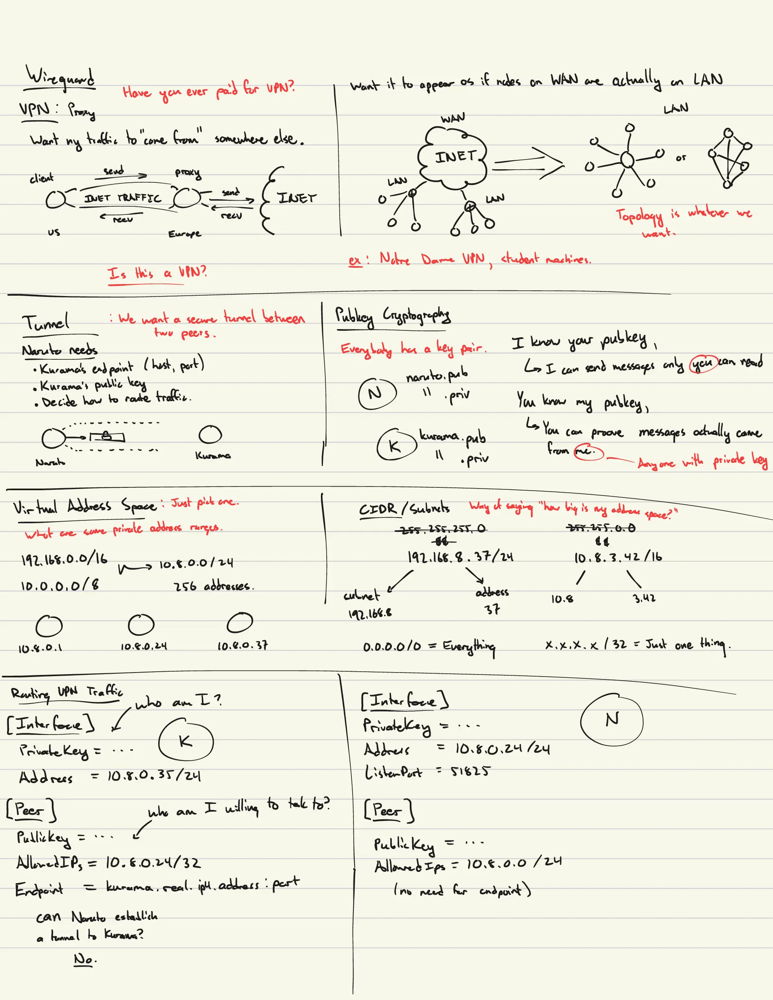

+++
title = "Contribution Guidelines"
description = "Guidance and best practices for writing and presenting a LUG meeting."
date = 2026-08-10
lastmod = 2026-08-10
writers = ["Sam Neisewander"]
tags = ["documentation"]
draft = false
+++

- [What we need from you](#what-we-need-from-you)
- [Meeting formats](#meeting-formats)
  - [Slideshow](#slideshow)
  - [Chalk Talk](#chalk-talk)
  - [Workshop](#workshop)
  - [Reading Group](#reading-group)
- [Workflow](#workflow)
- [LLM policy](#llm-policy)

If you are considering helping us write LUG meetings, thank you! This document
contains guidance for how to prepare for and deliver a great LUG meeting.

Please read:

- [What we need from you](#what-we-need-from-you)
- [Workflow](#workflow)
- [LLM policy](#llm-policy)
- [The README for this website](https://github.com/NDLUG/NDLUG.github.io/blob/main/README.md).

## What we need from you

Writing a LUG meeting has two big components. The first is your **presentation
materials**, which are the things you will need to facilitate the meeting. This
includes things like scripts, bulleted notes, full-on PowerPoints, or _whatever
it is you will bring with you the day of_. See
[Meeting formats](#meeting-formats) for tips on preparing your presentation
materials.

Second, there is your **writeup**: a Markdown document that captures the whole
content of your presentation in blog-post form. The writeup will appear as an
article in the [meetings listing on this website](). The
writeup may seem redundant, but it is meaningful because it acts as:

- Reference for those who couldn't attend the in-person meeting
- Resume material for you
- Meeting material that can be referenced / repurposed years into the future

## Meeting formats

Guidance on various meeting formats. We recommend you read the guidelines for
the sections relevant to you, or skim all of them if you are unsure how you want
to structure your meeting.

Dr. Thain is regarded as one of the best lecturers in the CSE department. Here
are some things he does that you should do as well:

- Mind the time.
- Ask your audience questions. Some questions can be layups that make it easy to
  participate (ex. what operating system do you use?). My favorite questions are
  ones that are puzzling, or challenge your assumptions or understanding of a
  topic (ex. "how do you tell time?" or "can you kill a thread?").
- Be interesting. dthain does jumping jacks, throws stuff, runs around,
  exaggerates his speech and expressions, etc. You don't have to do all that,
  but don't be afraid to tell a joke or have some personality. A good presenter
  is also an actor and a comedian.
- Pick one person in your audience and pay attention to how they react to you.
  You might notice boredom; then pick up the pace or move on. Confusion? Stop
  for questions. Sleepiness? Do something to regain attention.
- If you have a live demo, freeze it _once it works_ (that is, don't make any
  changes) and rehearse it before you present. Keep demos simple and sweet.
- Be careful about showing code. Code can be boring to look at, hard to read,
  and hard to reason through, especially if you aren't the author. Keep code
  snippets focused and simple.

### Slideshow

We assume you are already familiar with this format based on your experiences in
class, but here are some things to keep in mind:

- Prioritize function, not form. LUG doesn't have any bullshit "style points"
  you have to worry about (and neither will your future employer!).
- Begin your presentation with a brief agenda, and then at the end when you get
  to your Q/A slide, have it be the agenda (or your most interesting or
  question-worthy slide) to anticipate questions and requests to return to an
  earlier section to discuss it further.

Concerning text:

- Generally, prefer images and figures over text. Absolutely DO NOT prepare
  slides full of bulleted text and read directly from them.
- Avoid situations where your audience is trying to read text at the same time
  you are talking, because they can only focus on one or the other.
- Check contrast, and make your font size large.

Concerning figures and images:

- Blow them up so they occupy the entire space available on the slide.
- Try to give each important figure its own slide. This focuses the audiences
  attention and makes things easier to see.
- Always start the y-axis at zero. Clearly label your axes and title the figure.
  Speak on the interesting features of the data, and address anything that looks
  strange or that you don't understand.

### Chalk Talk

A chalk talk is like a classic classroom lecture -- you orate your presentation
while you draw figures on the board. Typically you would supplement this with a
live demo or two on your laptop.

This style poses some challenges:

- It is hard to write and draw legibly on a chalkboard.
- Drawing is slow, and will requires thought and attention to pace properly.
- This style forces you to understand what you are presenting on more deeply,
  since you will not have bulleted slides or speaker notes to read from.

A good chalk talk is engaging and easy to follow, because the pace at which the
audience is fed information is only be as fast as you can draw it and explain
it. This naturally helps slow things down, and makes it very easy to take notes
(the audience can just write exactly what you write).

A bad chalk talk is illegible, poorly paced (slow), and boring.

Here's how to prepare a good chalk talk: Write your notes on a piece of 8 1/2" x
11" paper divided horizontally into "chalkboards". Your notes should contain the
figures you intend to draw, with annotations that help guide your oration. Here
is an example: 

When planning figures, try to draw things once and reuse them where possible,
and try to leave things on the board for as long as possible before erasing
them. Often, you might refer back to something you drew earlier, or someone will
ask you a question about it, and it is helpful to still have that figure handy.
You should assume people listening are lagging about 30s - 1m behind what you
are doing presently, so if you obscure or erase something before that time, you
likely interrupted someone's thought process as they were trying to read what
you wrote and digest it.

> Really quick. This is the achilles heel of the slideshow format! Often,
> lecturers will give a "cookie clicker" slideshow presentation, where there are
> far too many slides, and a given slide is only visible for a few short seconds
> before it is out of sight. Or, worse yet, the presenter jumps around between
> several slides scattered about the deck as they speak. How can an audience
> possibly hope to follow along in those conditions? Why should they care to?

Practice your presentation beforehand on a chalkboard, and record yourself. You
might find that your handwriting is unreadable or that you wildly over/under-
estimated the time you took. These things should inform some revisions and help
you improve.

### Workshop

Workshops are much harder to plan than presentations, and they are prone to
[Murphy's Law](https://lawsofsoftwareengineering.com/laws/murphys-law/). Avoid
getting in over your head preparing a workshop when a similar effect could have
been achieved with a presentation. One problem we've had with workshops in the
past is that they are often bogged down by tedious software installation / setup
on the part of the attendees, and sometimes involve standing up infrastructure
on the part of the presenters. This pattern leads to really poor participation
and pacing most of the time.

> Examples: to do a Linux installation workshop, the presenters need to come
> prepared with a bunch of USB installation media (which is a PITA), and
> attendees need to be able and willing to wipe their laptop's disk or partition
> it... and no one wants to do that.
>
> To do a workshop on VMs, you need attendees to install a VM host on their
> laptops (which is a PITA) or have some kind of VM cluster prepared for
> attendees to SSH into (also a PITA).
>
> Once we did a workshop on VPNs, and the University firewall stuffed all the
> connections, but only when the workshop host was on the specific subnet in
> Fitz.

[henryj099](https://henryjochaniewicz.com/) suggested furnishing attendees with
a "PREREQUISITES.md" document that contains a guide for how to install all the
software or do all the configuration necessary for the workshop. Then, you can
skip all that junk and get right to the interesting bits during the workshop.
This seems to be a good idea.

Be sure to thoroughly test your workshop beforehand.

### Reading Group

A reading group is a guided reading of someone else's material. Maybe you found
a really interesting Hacker News article that you want to share. Maybe you found
a cool incident report that you want to talk about.

Is is good practice to curate brief portions of the source material that are the
most interesting to read together, and fill the rest of the time with commentary
elaborating on the piece or walking the audience through it like a narrative.

The biggest pitfall with this format is opening a PDF and reading straight from
the document. Audience members might as well read it themselves. What spin,
insight, context, and perspective can you add that makes it worthwhile to the
group?

## Workflow

Here is the lifecycle of a typical LUG meeting:

- A presenter volunteers to give a LUG talk on a topic of their choosing
- Officers give feedback on topic choice and give presenter a meeting date
- Presenter is granted access to the
  [NDLUG Github organization](https://github.com/NDLUG), the
  [repo for this website](https://github.com/NDLUG/NDLUG.github.io), and the
  club's
  [shared Google Drive](https://drive.google.com/drive/folders/1wyI0W2pRQxqA2yJLZ6JFNHN7KlhdqHtm?usp=sharing)
- Presenter is assigned an issue to track progress on their work for the
  meeting.
- Presenter creates a branch on the website repo named
  `[GITHUB_USERNAME]/[MEETING_NAME]`
- Presenter writes and saves presentation materials to the Google Drive, and
  writes, commits, and pushes their writeup to their branch on the website repo
- Officers follow up occasionally and provide feedback on presenter's work
- Presenter completes meeting, opens a PR for their site changes
- Officers mark the Github issue as complete and close the issue

If you have any questions, reach out to one of the
[officers]()

## LLM policy

This website [promises]():

> All of the content on this site is original, written by humans.

Therefore, please do not use LLMs for generate any of the written elements of
your writeup or presentation materials. Use of LLMs for other purposes, such as
research or image/figure generation, is OK. You are ultimately responsible for
the authenticity and correctness of what you contribute.
