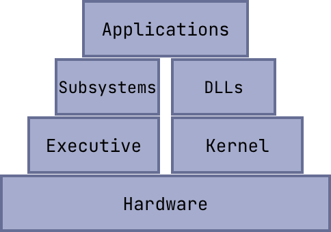
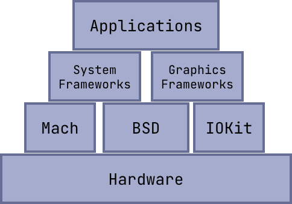
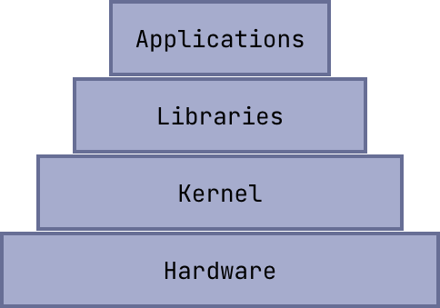
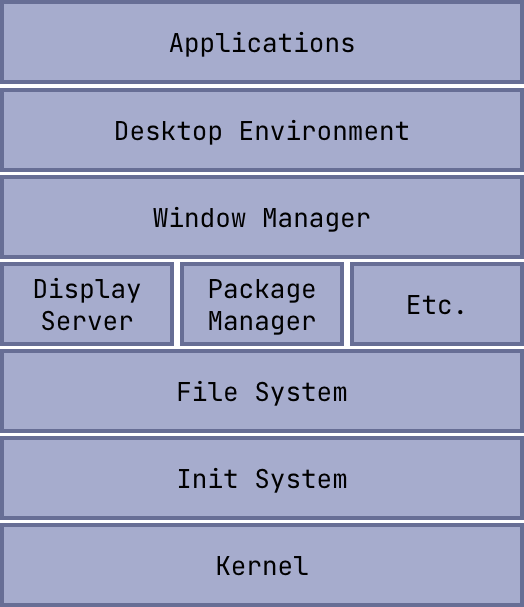
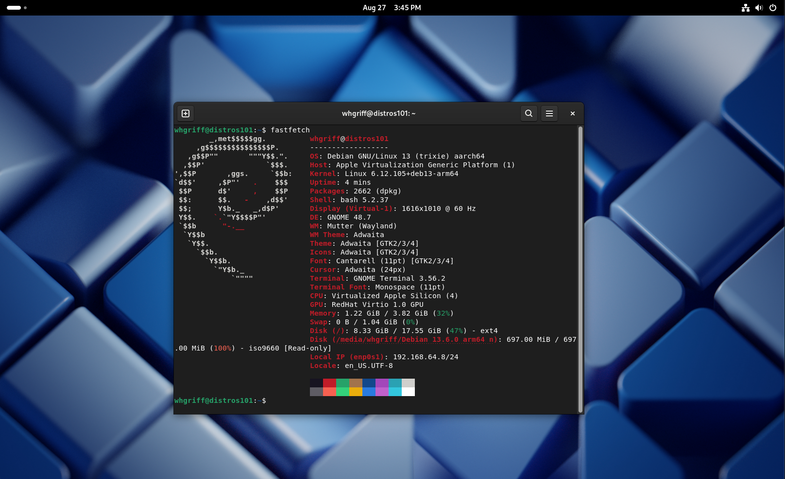
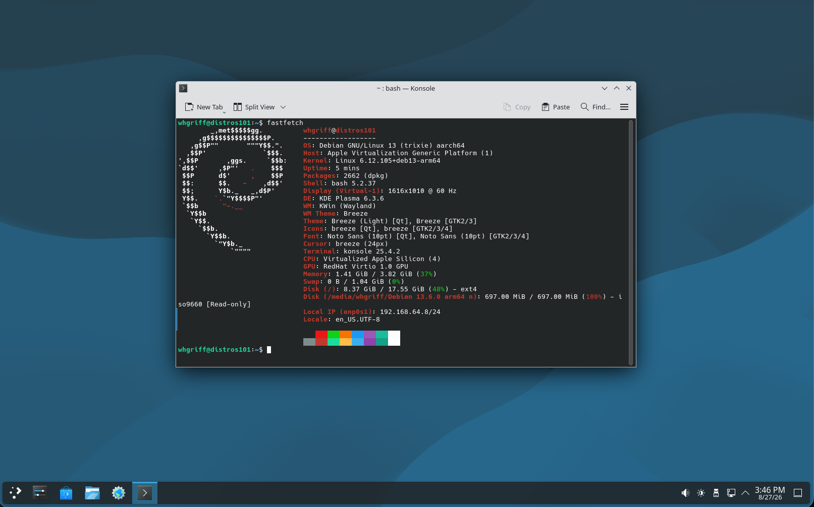
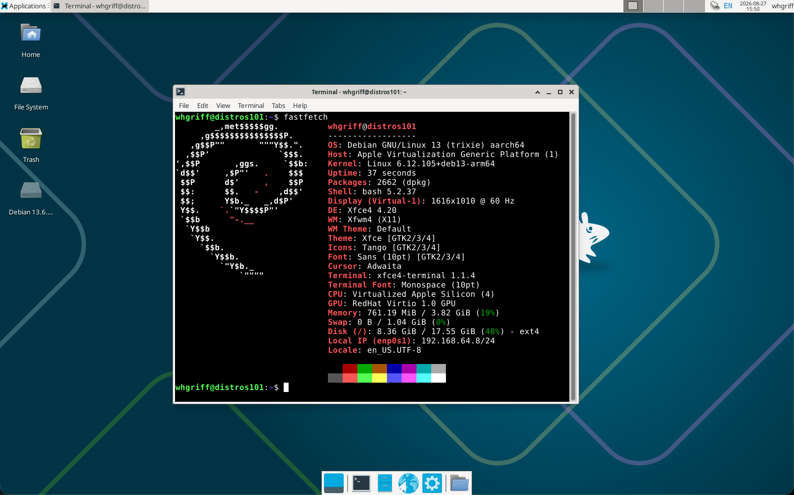
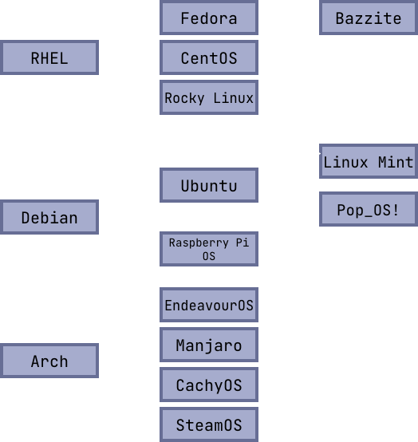

+++
title = "Distros 101"
description = "What makes up a Linux Distribution?"
date = 2026-09-27
lastmod = 2026-09-27
writers = ["Will Griffin"]
tags = ["linux", "distros"]
draft = false
+++

## A Linux Distribution

Typically seen as a general Linux desktop, a **distribution** is the custom
combination of system and operating software that is used by a specific
computer.

---

## Software Stacks across Operating Systems

First, let's look at some familiar diagrams.

This is the system stack of **Windows**. On a Windows machine, applications
interface with **environment subsystems** and **dynamic link libraries**, making
system calls to the **kernel**. The kernel references the **executive** to poll
hardware I/O, request memory, and interface with other processes. This entire
communication protocol is defined in the
[Windows API](https://en.wikipedia.org/wiki/Windows_API).

---

This is the system stack of **MacOS**. On a Mac, applications interface with
various **frameworks**, both ones pre-included with the system and ones
installed by users. These frameworks include system calls to the three-part
**XNU kernel**.

The XNU Kernel is made of

- **Mach microkernel:** Has the CPU scheduler, virtual memory, and inter-process
  communication
- **BSD Layer:** Has the networking and file system stacks, user management, and
  process control
- **IOKit:** Device drivers to interface with hardware

---

This is the (probably familiar) software stack of a **Linux** machine.
Typically, Linux has two general, but major layers between the hardware and
applications. There is the **library** layer, where lots of lower level
functionality is abstracted into usable functions for applications. Some of
these well known libraries include
[libc](https://en.wikipedia.org/wiki/C_standard_library) and
[libcrypto](https://wiki.openssl.org/index.php/Libcrypto_API). Below the library
layer is the **kernel** layer, where processes are scheduled, memory and
hardware I/O is managed, and other lower level operations (like those defined in
a trap table) are defined.

---

## The Distro Stack

For this, let's create a new stack of software applications that make up a Linux
distribution. When people talk about a certain "distro", they typically refer to
the specific combination of these applications.

Note that this covers Windows and Mac-specific instances of these applications.
Can we have distributions of MacOS and Windows? To some extent. While certain
Windows and Mac-specific counterparts will be mentioned for comparison's sake,
these operating systems heavily lock down your ability to switch these out and
customize them.

---

## The Kernel

From the definition in
[CSE 30341: Operating Systems](https://pnutz.h4x0r.space/courses/cse.30341.fa26/),
the kernel is the core of the operating system. It provides **abstractions**
such as _processes, threads, virtual memory, and filesystems_ such that
applications can efficiently utilize hardware and interact with each other.

Now, the main thing that makes Linux "Linux" is the
[Linux Kernel](https://kernel.org/). However, distros can still customize this.

Some distributions, such as [CachyOS](https://cachyos.org/) make tweaks to the
kernel to optimize compilation time and architecture building.
[Garuda Linux](https://garudalinux.org) uses the Zen Kernel which makes use of a
different scheduling algorithm to provide lower latency during heavy I/O
blocking operations.

Other distributions choose to run a different kernel, such as
[BSD Kernel](https://en.wikipedia.org/wiki/Berkeley_Software_Distribution).
While this is not technically Linux, it being UNIX-based makes it similar to the
Linux kernel, and distros such as [FreeBSD](https://freebsd.org) and
[NetBSD](https://netbsd.org) are typically associated with other typical Linux
distributions.

---

### Init System

The **Init System** is the process manager of the system. It is the first
program run by the operating system and typically gets **process ID 1**. It is
the process origin and orphanage and controls services (processes that run in
the background).

Some typical init systems include

- **systemd:** Today the most ubiquitous init system, this large service manager
  provides lots of process and service management tools _(systemctl)_ and
  logging features _(journalctl)_. It also houses user management
  _(systemd-logind)_, network configuration _(systemd-networkd and
  systemd-resolved)_, and time clock management _(timedatectl)_.
- **OpenRC:** A service manager built to run with a smaller init system
  (typically sysvinit). It provides a shell scripting interface to manage system
  srevices during boot, runtime, and shutdown.
- **runit:** Replacement for systemd that is a smaller, faster init system and
  process manager. Services are defined using basic execute and logging shell
  scripts and are symlinked to enable/disable.
- **launchd:** MacOS's init system. It is made of LaunchAgents (user services)
  and LaunchDaemons (root services). Services are defined in `.plist` files
  using XML.
- **wininit.exe:** (Part of) Windows' init system. This specifically is the
  first system process started during the boot sequence, but does not handle
  processes and services directly. Windows' full service management is from a
  suite of applications like `services.exe` and `csrss.exe`.

---

### File System

The File System manages file organization and storage. It handles the files and
directories and depicts it as the familiar tree file structure we know.

Some file systems include

- **ext4:** The "default" file system option in Linux. It can handle files as
  large as 16TiB. One key feature is **journaling**, where file changes are
  stored in a journal to provide crash consistency.
- **xfs:** The larger-file complement to **ext4**. It is proficient with
  parallel I/O and is good with many storage devices. It's max file size is 8
  EiB.
- **btrfs:** The binary tree file system. It makes use of **copy-on-write**
  where new file data is written to a new location, allowing for file
  snapshotting at save intervals. This leads to easier file recovery of
  corrupted or lost files.
- **fat32:** An older **portable** file system. This is **cross platform** to
  work on Windows, MacOS, and Linux, and is typically seen on removable media.
  However, it can only support files as big as 4 GiB.
- **exFAT:** A newer portable file system. It is also cross platform and can
  handle modern file sizes up to 16 EiB.

The Windows and MacOS file systems respectively are

- **NTFS:** The standard Windows file system. It has a theoretical max file size
  of 16 EiB but due to Windows 11 limitations, the actual enforced max file size
  is 256 TiB.
- **APFS:** The Apple file system. It has the feature of space sharing, where
  multiple volumes can exist on a single storage device, and that the volumes
  can grow and shrink dynamically without losing data.

---

### Package Manager

There are two main categories of package managers: distro-specific and general
purpose.

Distro-specific package managers, like **apt**, **dnf**, and **pacman**, are
associated with distros, as their underlying technologies (`deb`, `rpm`,
`pkg.tar`) are used to handle the distro system libraries and package
repositories.

General-use package managers, like **snap**, **flatpak**, and **AppImage**,
provide a distro-independent interface to manage packages, but they are not as
tied into the system and potentially require more maintenance for system updates
and conflict resolution.

Package managers also exist on Windows
([winget](https://learn.microsoft.com/en-us/windows/package-manager/)) and MacOS
([homebrew](https://brew.sh/)).

---

### Display Server

A display server is just the middleman between hardware I/O and the application
itself. There are two main display servers in use today.

**X11** is the older option. It operates as a monolithic display server, where a
single instance of X controls rendering and hardware interaction for all
applications. This means there is no separation between apps, and apps can
listen to other apps' hardware communication.

**Wayland** is the newer option. It operates as a micro-display server in the
sense that each application is isolated in its communication stream. However,
Wayland is different than X11 in that it is a _protocol_ that is implemented by
the window manager (known as a **Wayland compositor**).

---

### Window Manager

Window managers handle windows, simply put. They handle window **appearance**
(borders, title bars, buttons, ...) and **actions** (resizing, moving, stacking,
tiling, ...). Typically, they either are heavily tied with a specific desktop
environment or work independently.

**Kwin** and **Mutter** are window managers heavily tied to **KDE** and
**GNOME** respectively. They aren't really ever meant to be run on their own,
and provide an extremely limited user experience when done so.

**i3** and **bspwm** are examples of _tiling_ X11-based window managers. They
are independent of a desktop environment, so people who use them typically
customize their system by combining them with menu bars, application launchers,
and other keybinds to make their workflow efficient. (side note: a tiling window
manager is one where windows are not "floating" in screen space, they snap to
screen or window edges and typically stay aligned in some screen ratio)

---

### Desktop Environment

Desktop environments offer the "main look" of a computer. They are a software
suite that consists of menu bars and menus, status and settings applications,
and a handful of applications (like a web browser and file explorer) to get
users started.

Some currently notable desktop environments include
[GNOME](https://www.gnome.org/), [KDE Plasma](https://kde.org/plasma-desktop/),
and [XFCE](https://www.xfce.org/) (shown below).

---

### Ricing

As with any good software engineer or hacker, we should get accustomed to the
tools we use, and customize them to best serve our needs. Customization of your
distro and environment is known as **ricing**, where the user interface
appearance and action is tweaked to the user's wants.

For some inspiration, check out [r/unixporn](https://reddit.com/r/unixporn/).

---

### Today's Distributions

There are [a lot](https://en.wikipedia.org/wiki/List_of_Linux_distributions) of
Linux distributions today.

Here's a diagram of some of the notable ones. Most distributions are a
downstream of **RHEL/Fedora**, **Debian**, or **Arch**. But, many exist.

[Alpine](https://alpinelinux.org/) is a good choice for Docker containers
because it is extremely lightweight. It uses musl libc and OpenRC.

[Gentoo](https://www.gentoo.org/) is a fun tinkerer's choice as its main method
of package installation is compilation, not downloading pre-compiled binaries.
It has an emphasis on customization.

[Asahi](https://asahilinux.org/) is an option for those choosing to run Linux on
Apple Silicon machines. It is currently being developed for the latest M-series
chips and has lots of interesting articles on reverse-engineering Apple's
products.

[FreeBSD](https://www.freebsd.org/) is an alternative to GNU/Linux as it uses
the BSD Kernel, and with its software falling under the BSD license, it provides
a different flavor of open source.

---

### Extra

If you're looking to try out a Linux distribution, I'd highly recommend
something like [Ubuntu](https://ubuntu.com) or
[Fedora](https://fedoraproject.org). They offer a good mix of recent software
and dependability, and both are widely used, so there are plenty of support
articles and guides. I personally have used Fedora since this past summer, and
I've found it very easy to move over and use for my personal computing.

If you want to answer an initial questionnaire and let distros fight it out to
see which one you should try next, check out
[distrofighter](https://distrofighter.com)!

If you want to try out a distro but don't want to spin up an entire virtual
machine, check out [distrosea](https://distrosea.com).
